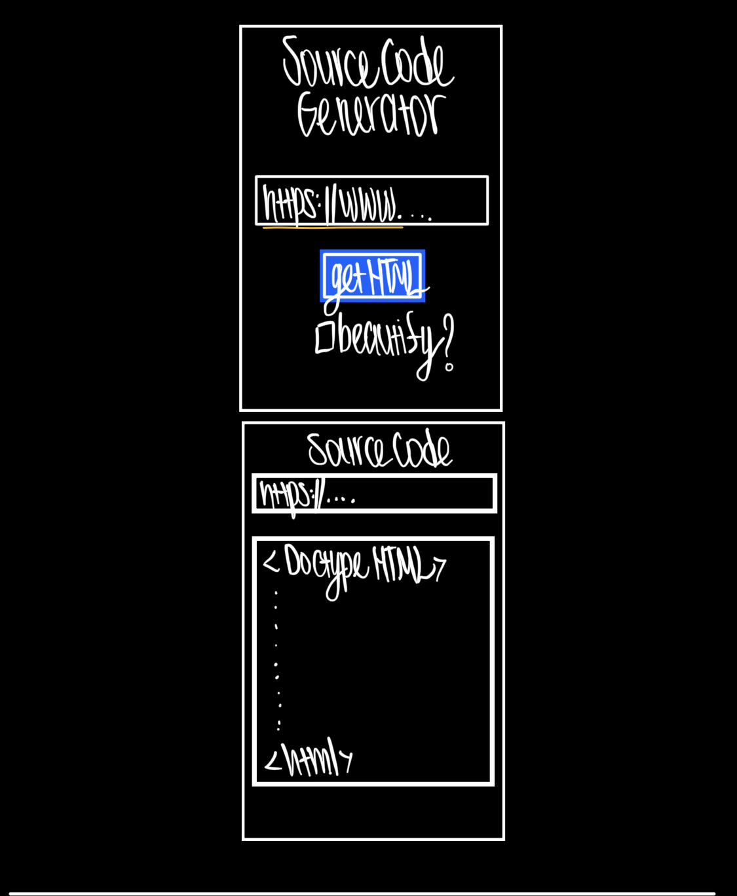
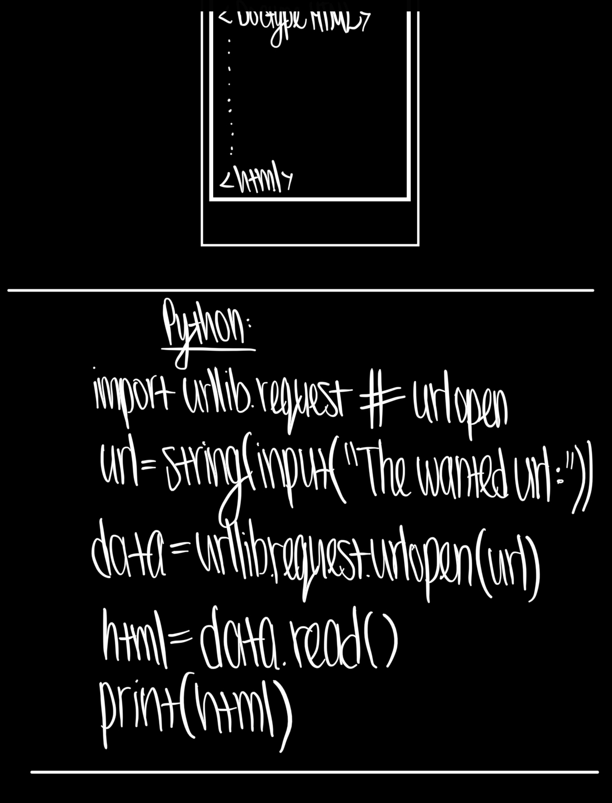

# Source Code Viewer Web Application (Django)  
This website gets a url and returns the HTML (source code) of the website.   

https://source-code-django.vercel.app  

The issues were fixed (somehow). The 403 error was fixed by not using the 'urllib' library and using the 'requests' library instead for the web scraping (or at least that's what I think), and it seems to work even when my cookies are disabled.  

~(I still haven't fixed: the 403 error for some websites and that it don't work without cookies😅)~  
  
~This code doesn't work on vercel (yet) so I copy-pasted my code to their Django template so it would deploy. I need to rewrite this code but for now its running here:  https://django-source-code.vercel.app/~  

  
  

## How to use?
$ python manage.py runserver   
go to http://127.0.0.1:8000/ 

## To Do:
1. style the html files with separate CSS file (how to add CSS to Django?)
2. beautify the output HTML 
3. Publish it (?) if it isn't expensive
4. Fix the code so it'll work with: diabled cookies, websites that return 403 error,
5. Add tests
6. Add the url that was given in the input to the output url (/output/https://google.com)
7. display a message insted of an error when the user tries to enter '' (empty string).  

## How to create Django project from Macbook terminal?
$ cd Desktop  
$ mkdir sourcecode  
$ cd sourcecode  
$ python3 -m venv .venv  
$ source .venv/bin/activate  
$ pipenv install django  
$ pipenv install urllib3  
$ pipenv install bs4  
$ pipenv install beautifulsoup4  
$ pipenv install requests  
$ code . (or open the new project in vscode)  
$ pipenv shell  
$ django-admin startproject sourcecode .  
$ python manage.py startapp inspector    

$ pip freeze > requirements.txt  

<!-- 
## From https://github.com/codesandbox/codesandbox-template-django:
$ python -m venv .venv  
$ source .venv/bin/activate  

(.venv) $ pip install -r requirements.txt  
(.venv) $ python manage.py migrate  
(.venv) $ python manage.py createsuperuser  
(.venv) $ python manage.py runserver  
Load the site at http://127.0.0.1:8000  

$ pipenv install  
$ pipenv shell  
(.venv) $ python manage.py migrate  
(.venv) $ python manage.py createsuperuser  
(.venv) $ python manage.py runserver  
Load the site at http://127.0.0.1:8000   

$ python -m venv .venv  
$ pip install django  
$ pip install urllib3  

https://codinggear.blog/how-to-upload-django-project-to-github/?expand_article=1  
-->
